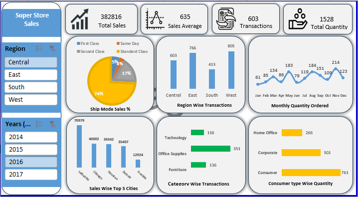

# Super Store Sales Data Analysis & Excel Dashboard

## 📊 Project Overview
This project presents an interactive Excel Sales Dashboard built for analyzing key retail metrics across different regions, customer segments, product categories, and sales trends from 2014 to 2017.
## 🖼️ Dashboard Preview

## 📈 Key Metrics (KPIs)
* **Total Sales**: $382,816
* **Sales Average**: $635
* **Total Transactions**: 603
* **Total Quantity Sold**: 1,528 units
## 🔍 Key Insights
1. **Shipping Preferences**: Standard Class dominates sales volume at **74%**, followed by Second Class at **17%**.
2. **Regional Performance**: The **West** region leads in total transaction volume (805 transactions), closely followed by the **East** region (766 transactions).
3. **Top Performing Cities**: **Lafayette** generated the highest sales ($70,979), followed by Chicago ($40,002) and Houston ($39,342).
4. **Category Breakdown**: **Office Supplies** generated the highest number of transactions (351), followed by Furniture (136) and Technology (116).
5. **Customer Segments**: **Consumer** segment accounts for the highest quantity ordered (761 units), followed by Corporate (501 units) and Home Office (266 units).
## 🛠️ Tools & Technologies Used
* **Microsoft Excel**: Pivot Tables, Data Modeling, Slicers, Custom Charting, Visual Formatting.

## 📂 Repository Structure
* `Super_Store_Sales_Dashboard.xlsx`: Interactive Excel Workbook containing raw data, pivot tables, and dashboard visuals.
* `assets/`: Contains screenshots and visual assets for documentation.
* `data/`: Raw dataset used for analysis.
## 🚀 How to View the Dashboard
1. Clone or download this repository.
2. Open `Super_Store_Sales_Dashboard.xlsx` in **Microsoft Excel 2016** or newer.
3. Use the region and year slicers on the left sidebar to dynamically filter insights.
